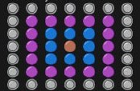

# Session 11

In this session, I wrote below programs with object oriented programming:

 - **Calculate Fractions**, This program calculates below operators between fractions:

    - *Sum*
    - *Division*
    - *Subtraction*
    - *Multiplication*
    - *Fraction number*
    - *Conventionalize*

 - **Convert Time**, This Program converts and calculates time: 

    - *To GMT Time*
    - *Subtraction*
    - *To Second*
    - *To Hour*
    - *Sum*

    
 - **Calculate complex number**, This program calculates below operators between complex numbers: 

    - *Sum*
    - *Subtraction*
    - *Multiplication*


- **Carpet**, This program draws a n*n carpet shape if n is odd, like below output:



---

## Usage

**To run Calculate Fractions Program :**

```
python fract.py
```
**To run Convert Time program :**

```
python timee.py
```
**To run Calculate complex number program :**

```
python complex.py
```
**To run carpet program :**

```
python carpet.py
```

