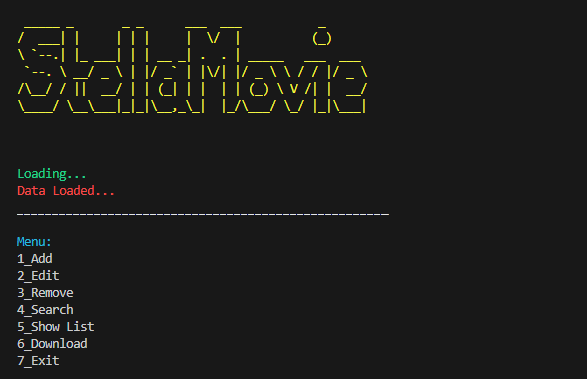

# Session 12

In this session, I wrote a **media program** which has below features:

 - *Add movies* 
 - *Edit movies* 
 - *Remove movies* 
 - *Search movies* 
 - *Show movies's list* 
 - *Download movies* 
  




---
> [!NOTE]
> Some .py files such as **documentary.py** , **clip.py** , **film.py** , **series.py** are not used in this program, They are written just as a exercise to learn object oriented method.

## Usage

**First install needed libraries :**
```
pip install -r requirements.txt
```

**To run media program :**

```
python main.py
```

