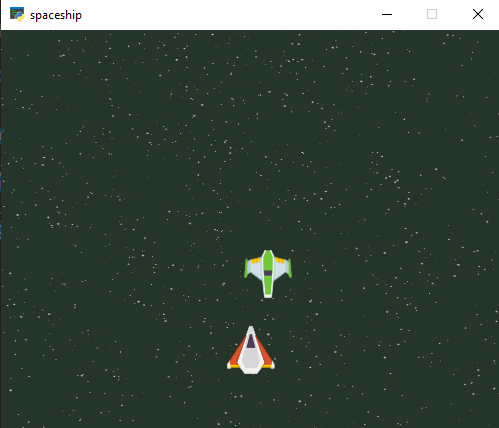
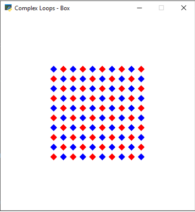

# Session 13

In this session, I wrote a **Spaceship GAME** which has below output:
  



Another program is about showing below output:
  



---
## Python

I use [**Arcade**](https://api.arcade.academy/en/latest/get_started.html) a modern Python Module used widely for developing 2D video games with compelling graphics and sound for these program.

---
## Usage

**First install needed libraries :**
```
pip install -r requirements.txt
```

**To run Spaceship GAME:**

```
python spaceship.py
```
**To run second program:**

```
python box.py
```

