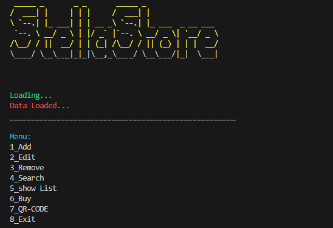

# Session 21

- In this session, I wrote a **store program** which has below features:

 - *Add products* 
 - *Edit products* 
 - *Remove products* 
 - *Search products* 
 - *Show products's list* 
 - *Buy products* 
 - *Products QRcode* 



- And also a program which *Generates A Music*


---

## Python

- I use [**Pysynth**](https://github.com/mdoege/PySynth), a module which provides a simple way to create music with Python. The **pysynth** module allows you to define melodies and generate WAV files. It's great for quickly prototyping musical ideas or creating simple music for projects.

- I use [**sqlite3**](https://docs.python.org/3/library/sqlite3.html), a module which provides a lightweight, disk-based database that doesn't require a separate server process. The **sqlite3** module allows you to create, read, update, and delete data using SQL commands. It's excellent for applications that need a simple, efficient way to manage relational data without the overhead of a full database server.

---

## Usage

**First install needed libraries in each Folder:**
```
pip install -r requirements.txt
```

**To run Store, First Open the sql_store folder then Run below command :**

```
python store.py
```
**To run Music Generator, First Open the song_pysynth folder then Run below command :**

```
python music.py
```

