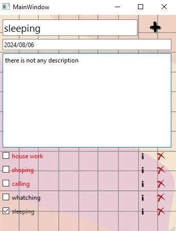

# Session 22

- In this session, I wrote a **TODO LIST** which has below features:

 - *Add title* 
 - *Add description* 
 - *Add date* 
 - *Delete task* 
 - *Done task* 





---

## Python

- I use [**Pyside6**](https://pypi.org/project/PySide6/), A module which provides a set of C++ technologies for building user interfaces. The QtWidgets module provides a set of UI elements to create classic desktop-style user interfaces.

- I use [**sqlite3**](https://docs.python.org/3/library/sqlite3.html), a module which provides a lightweight, disk-based database that doesn't require a separate server process. The **sqlite3** module allows you to create, read, update, and delete data using SQL commands. It's excellent for applications that need a simple, efficient way to manage relational data without the overhead of a full database server.

---

## Usage

**First install needed libraries:**
```
pip install -r requirements.txt
```

**To run Todo_List:**

```
python main.py

```
**OR**

```
main.exe 
```


