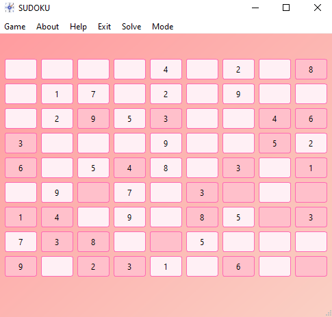

# Session 23

In this session, I completed **Sudoku Game**:
  
- Sudoku is a logic-based number puzzle game that challenges players to fill a 9x9 grid with numbers so that each column, each row, and each of the nine 3x3 subgrids contain all of the digits from 1 to 9. 


    

    My program has below features:
    
    1. You can open text file to have your own Sudoku puzzle.
    2. You can see solved puzzle by go to menubar and select Solve.
    3. You can change Game's theme by go to menubar and select Mode.

    

---
## Python

- I use [**Pyside6**](https://pypi.org/project/PySide6/), A module which provides a set of C++ technologies for building user interfaces. The QtWidgets module provides a set of UI elements to create classic desktop-style user interfaces.

- I use [**py-sudoku**](https://github.com/jeffsieu/py-sudoku), a library for solving and generating Sudoku puzzles. The `py-sudoku` library provides a range of tools to create, solve, and display Sudoku puzzles with ease.


---
## Usage

**For Run Game first install needed libraries:**
```
pip install -r requirements.txt
```

**To run Game**: 

```
python main.py
```


