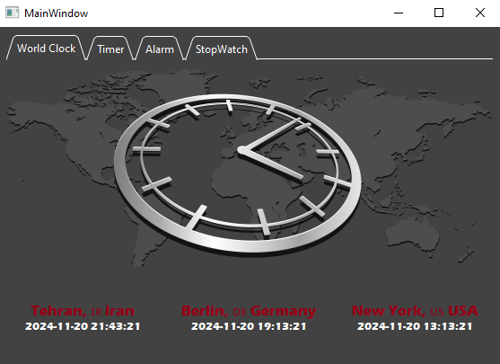
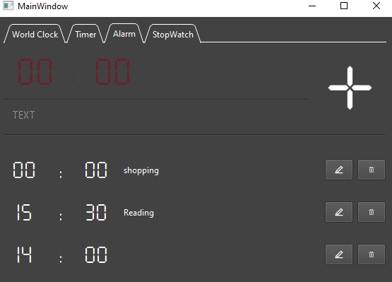
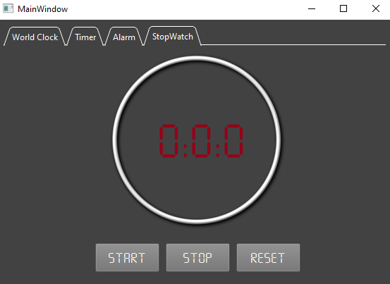
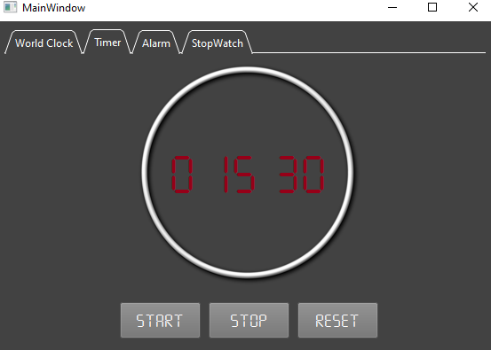

# Clock App

Clock App is a versatile application that combines multiple time-related functionalities into a single, user-friendly interface. It includes a World Clock, Alarm, Stopwatch, and Timer, all neatly packaged with a stylish dark cherry theme and a custom SevenSegment font.

## Features

### 🌏 World Clock
- Show live time of:
  - 🇮🇷 Iran
  - 🇩🇪 Germany
  - 🇺🇸 USA

  

### ⏰ Alarm
- Read alarms from an SQLite database and display them in a list.
- ➕ Add new alarm.
- 📝 Edit existing alarms.
- ❌ Remove alarms.
- ❕ Show notification at the alarm's time.

  

### ⏱️ Stopwatch
- Start, stop, and reset the stopwatch.

   

### ⏲️ Timer
- Initialize time set by the user.
- Start, stop, and reset the timer.
- Show notification at the end of the countdown.

   

## Technical Highlights

- **Object Oriented Programming**: The application is built using OOP principles to enhance modularity and maintainability.
- **Each Class In A Separate File**: Classes are organized into separate files for better structure and readability.
- **Portable SevenSegment Font**: The custom SevenSegment font is embedded in the application, ensuring it displays correctly on any system without requiring installation.
- **Generate EXE File**: The project can be compiled into an executable file for easy distribution.

## Getting Started

### Prerequisites
- Python 3.8 or higher
- PySide6 library

Install PySide6 using pip:
```bash
pip install PySide6
```

## Installation

1. **Clone the repository**:
   ```bash
   git clone https://github.com/yourusername/clock-app.git
   
   cd clock-app


2. **Install the required libraries**:
   ```bash
   pip install -r requirements.txt

3. *Run the application**:
   ```bash
   python main.py
   ```

## Usage

Upon running the application, you'll have access to the World Clock, Alarm, Stopwatch, and Timer functionalities. The UI is intuitive and easy to navigate, with buttons and inputs clearly labeled for each function.