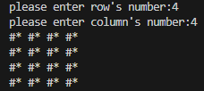
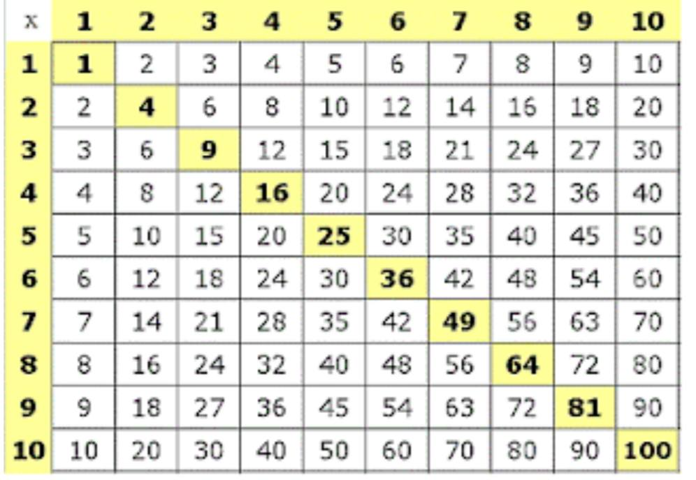
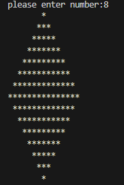
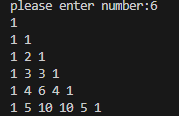

# Session 5

In this session, I wrote below programs:

 - A function which gets **n and m parameters** and print **n*m matrix** like below output :



- A function which gets **n and m parameters** and print **n*m multiplication matrix** like below output :



- A function which gets **n parameter** and print **a rhombus of size n** like below output :



- A function which gets **n parameter** and draws **Pascal's triangle up to line n** like below output :





---

## Python

You just need below libarary :

- [math](https://www.w3schools.com/python/module_math.asp) *(khayam_triangle.py)*


 Other requirerments  :
 
 - windows x64
 - python 3.9.7

---

## Usage

**To run first function :**

```
python star_table.py
```

**To run second function :**

```
python multiply_table.py
```

**To run third function :**


```
python diamond.py
```

**To run fourth function :**

```
python khayam_triangle.py
```
