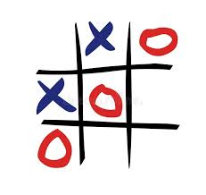
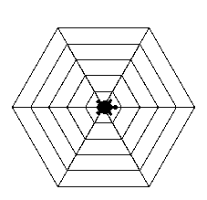
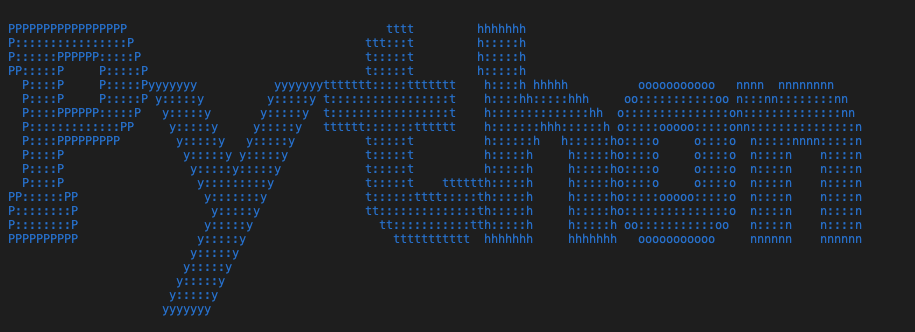

# Session 6

In this session, I wrote below programs:

 - **TicTacToe Game** 



- A program to **draw the geometric** figure below:


- **Cubic Equation Calculator**

- **Quadratic Equation Calculator** 

---

## Python
I use below libraries in each specific program:

- [PythonTurtle](https://pypi.org/project/PythonTurtle/)   (*draw_turtle.py*) 



- [pyfiglet](https://www.geeksforgeeks.org/python-ascii-art-using-pyfiglet-module/)   (*TicTacToe.py*)



- [termcolor](https://pypi.org/project/termcolor/)   (*TicTacToe.py*)

---

## Usage

**First install needed libraries :**
```
pip install -r requirements.txt
```

**To run TicTacToe Game :**

```
python TicTacToe.py
```

**To run draw the geometric program :**

```
python draw_turt.py
```
**To run Cubic Equation Calculator :**

```
python cubic_eq.py
```
**To run Quadratic Equation Calculator :**

```
python quadratic_eq.py
```
