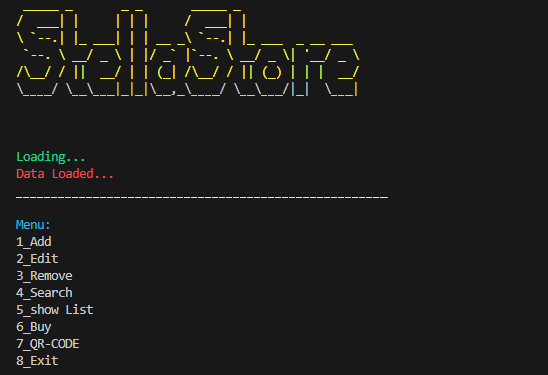
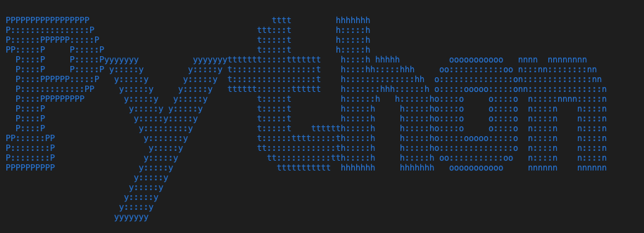

# Session 7

In this session, I wrote a **store program** which has below features:

 - *Add products* 
 - *Edit products* 
 - *Remove products* 
 - *Search products* 
 - *Show products's list* 
 - *Buy products* 
 - *Products QRcode* 




---

## Python
I use below libraries :

- [qrcode](https://pypi.org/project/qrcode/) 


- [pyfiglet](https://www.geeksforgeeks.org/python-ascii-art-using-pyfiglet-module/)



- [termcolor](https://pypi.org/project/termcolor/)  

---

## Usage

**First install needed libraries :**
```
pip install -r requirements.txt
```

**To run Store :**

```
python store.py
```

