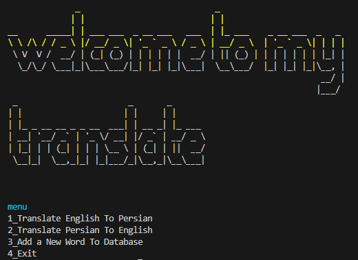

# Session 8

In this session, I wrote a **Translator Program** which has below features:

 - *Translate English to Persian* 
 - *Translate Persian to English* 
 - *Add New Word* 
 - *Convert Translated text to voice* 
 




---

## Python
I use below libraries in specified code :

- [gtts](https://gtts.readthedocs.io/en/latest/https://gtts.readthedocs.io/en/latest/) (*translate.py*)  (*convert_text_to_voice.py*)  

- [pyfiglet](https://www.geeksforgeeks.org/python-ascii-art-using-pyfiglet-module/) (*translate.py*)

- [termcolor](https://pypi.org/project/termcolor/) (*translate.py*)

- [imageio](https://pypi.org/project/imageio/#:~:text=Imageio%20is%20a%20Python%20library,and%20is%20easy%20to%20install.&text=See%20the%20API%20Reference%20or%20examples%20for%20more%20information.) (*gif.py*)

- [os](https://www.geeksforgeeks.org/python-os-system-method/#:~:text=system%20in%20Python%3F-,os.,exit%20code%20of%20the%20command.) (*gif.py*)

---

## Usage

**First install needed libraries :**
```
pip install -r requirements.txt
```

**To run Translator Program :**

```
python translate.py
```
**To run GIF creator :**

```
python gif.py
```
**To run Convert text to voice :**

```
python convert_text_to_voice.py
```

