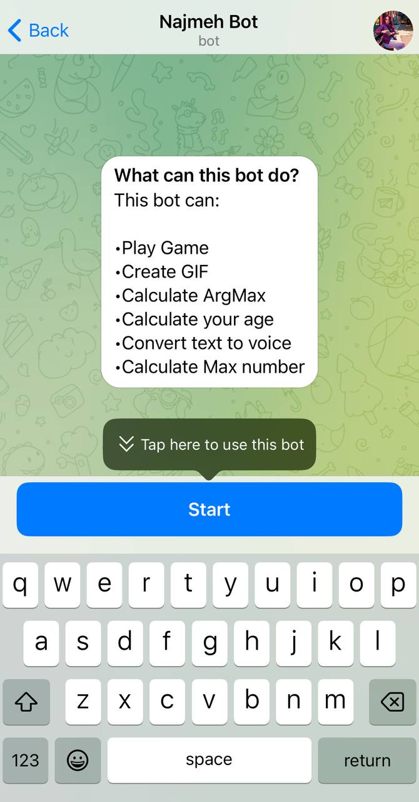
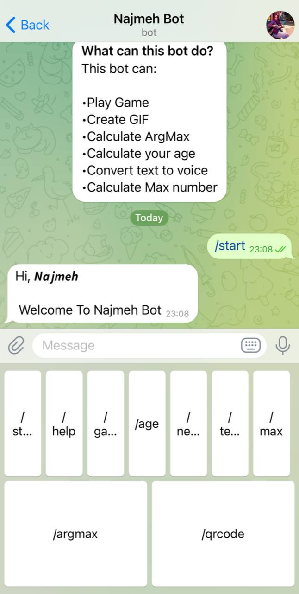
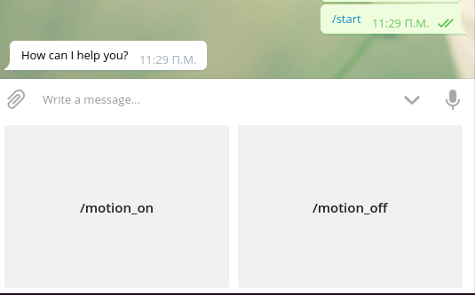

# Session 9

In this session, I wrote a **Telegram Bot** which has below features:

 - *Play Game* 
 - *Create GIF* 
 - *Calculate your age* 
 - *Calculate MAX number* 
 - *Convert text to voice* 
 - *Calculate ARGMAX number* 
 



---

## Python
I use below libraries :

- [gtts](https://gtts.readthedocs.io/en/latest/https://gtts.readthedocs.io/en/latest/)
- [khayyam](https://pypi.org/project/Khayyam/)  
- [qrcode](https://pypi.org/project/qrcode/)


- [telebot](https://pypi.org/project/pyTelegramBotAPI/)


 

---

## Usage

**First install needed libraries :**
```
pip install -r requirements.txt
```

**To run Telegram Bot :**

```
python telegrambot.py 
```


